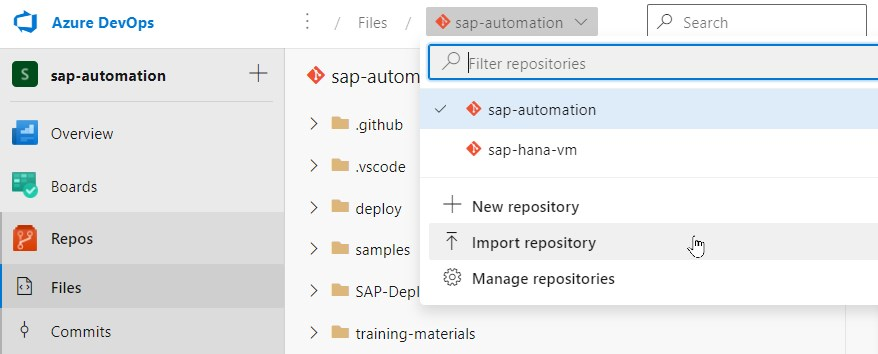
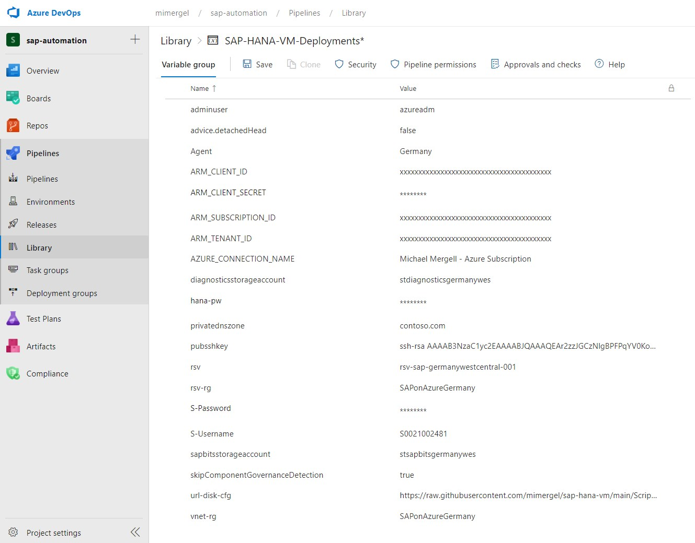
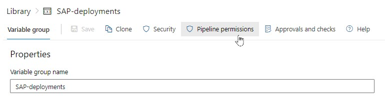
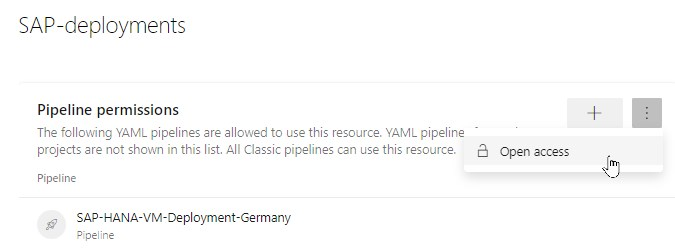
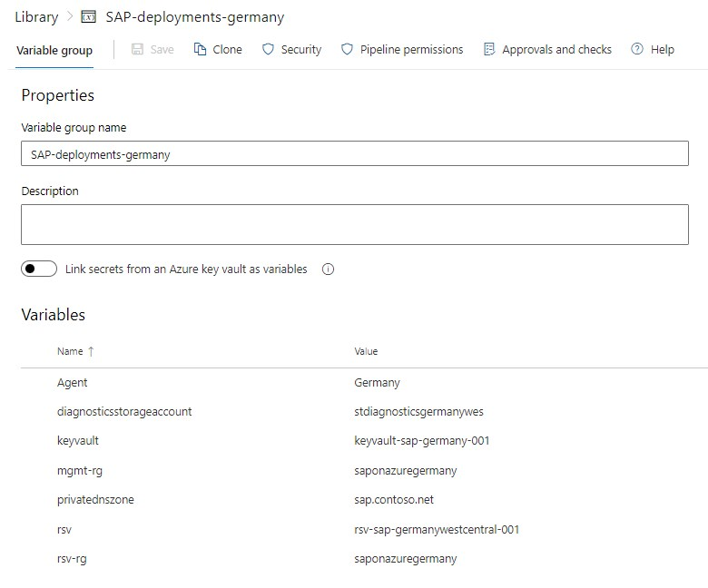
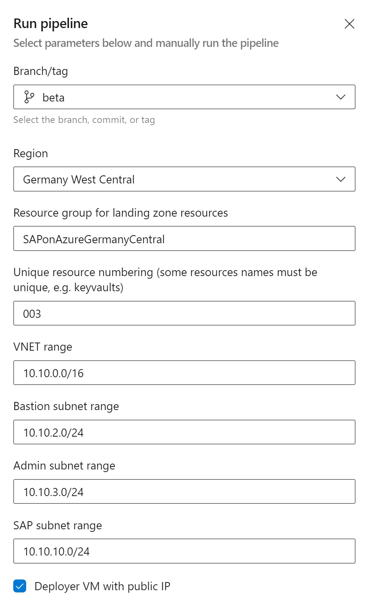
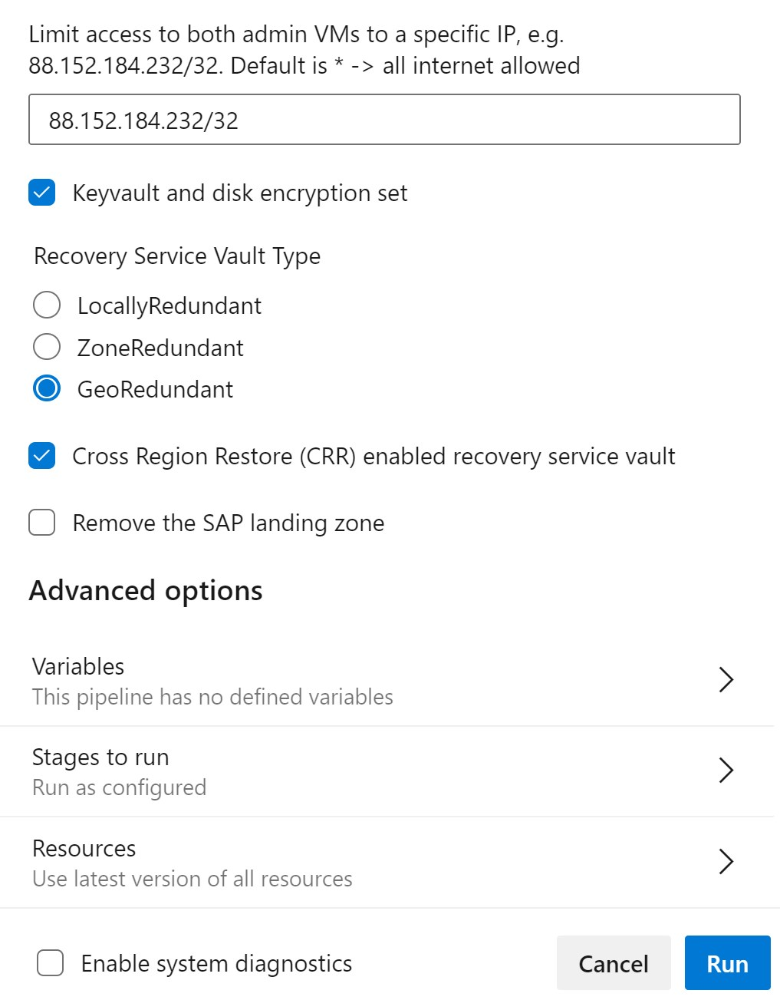
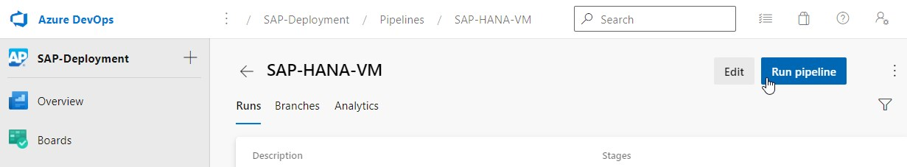
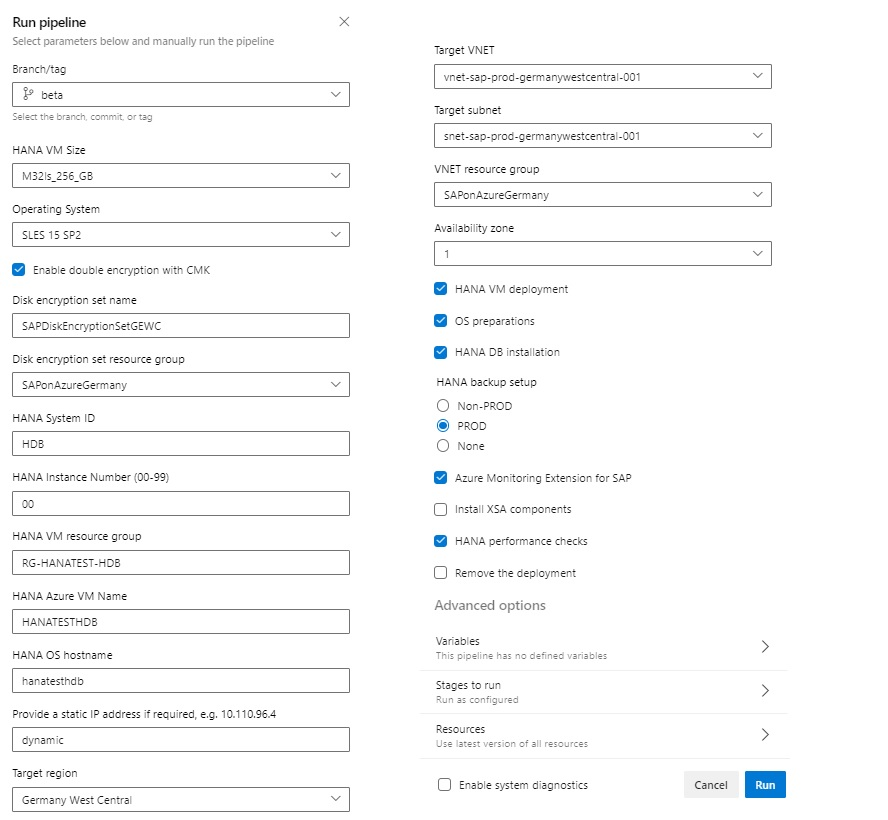
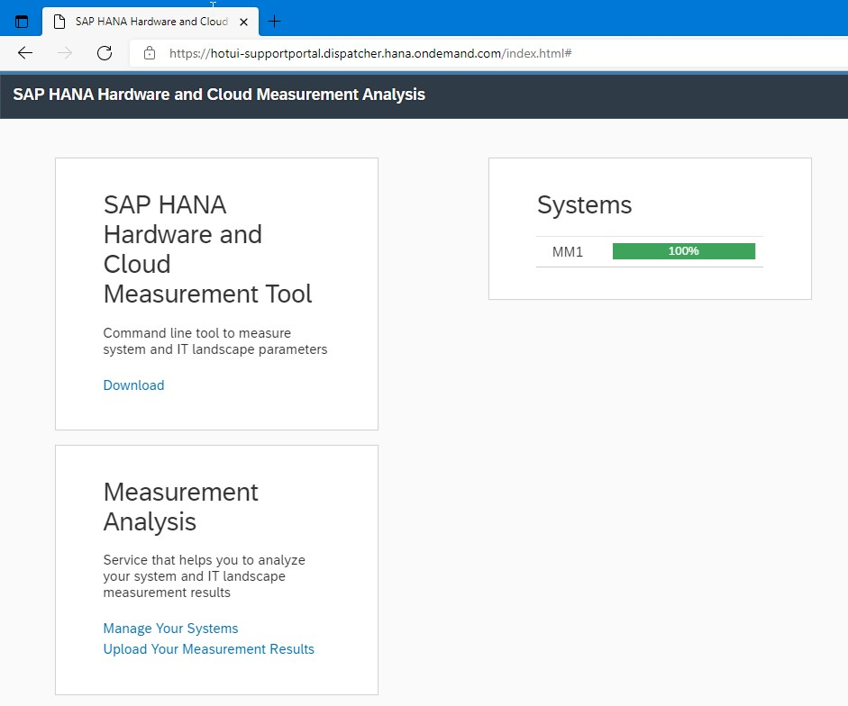

Table of contents
=================

<!--ts-->
- [SAP HANA VM Deployments](#SAP-HANA-VM-Deployments)
- [Deployment Framework](#deployment-framework)
- [HANA VM Sizes and Storage Configurations](#hana-vm-sizes-and-storage-configurations)
- [Prerequesites for SAP HANA Deployments](#prerequesites-for-sap-hana-deployments)
- [Deploy the landing zone](#deploy-the-landing-zone)
- [Deploy SAP HANA VMs](#deploy-sap-hana-vms)
- [HANA Cloud Measurement Test Results](#hana-cloud-measurement-test-results)
- [SAP App VM Deployment](#sap-app-vm-deployment)
- [Troubleshooting](#troubleshooting)
- [FAQ](#faq)
- [Disclaimer](#disclaimer)
<!--te-->

# SAP HANA VM Deployments

This repository is used to deploy SAP HANA Databases 2.0 with Azure DevOps including the following options: 

* SLES 12 & 15
* RHEL 7 & 8 
* VM sizes from 128GB to 12TB
* Optional double disk encryption at rest (platform and customer managed keys)
* Deployment wih Azure or own custom images
* OS Preparation with required patches and configurations according to relevant SAP notes
* HANA 2.0 Installation
* Backup Integration into an Azure Recovery Service Vault including optional execution of initial OS & HANA backups
* Selective disk backup, which excludes hana log & data disks from the OS backups
* Setup Azure Monitoring Extension for SAP
* Execution quality checks (WIP)
* Execution of HANA Cloud Measurement Tool (HCMT)
* Removal of the complete deployment 

# Deployment Framework

The DevOps Pipeline is used as a GUI to simplify deployments. It fetches the pipeline from the GitHub repository. The GitHub repository itself can be most easily adapted to your landing zone specifics with Visual Studio Code on your local PC. In the grey rectangle we see the Ubuntu VM which acts as deployment agent and the require Azure ressources like VNET, Recovery Service Vault, Storage, etc. 


# HANA VM Sizes and Storage Configurations

<table>
	<tr>
		<th>Size</th>
		<th>HANA VM</th>
		<th>HANA VM Storage (EXE + DATA + LOG + SHARE + BACKUP)</th>
	</tr>
	<tr>
		<th>128_GB</th>
		<td>E16ds_v4</td>
		<td>1xP6(64GB) + 3xP6(64GB) + 3xP10(128GB) + 1xP20(512GB) + 1xP20(512GB)</td>
	</tr>
	<tr>
		<th>160_GB</th>
		<td>E20ds_v4</td>
		<td>1xP6(64GB) + 4xP6(64GB) + 3xP10(128GB) + 1xP20(512GB) + 1xP20(512GB)</td>
	</tr>
	<tr>
		<th>192_GB</th>
		<td>M32ts</td>
		<td>1xP6(64GB) + 4xP6(64GB) + 3xP10(128GB) + 1xP20(512GB) + 1xP20(512GB)</td>
	</tr>
	<tr>
		<th>256_GB</th>
		<td>M32ls</td>
		<td>1xP6(64GB) + 4xP6(64GB) + 3xP10(128GB) + 1xP20(512GB) + 1xP20(512GB)</td>
	</tr>
	<tr>
		<th>384_GB</th>
		<td>E48ds_v4</td>
		<td>1xP6(64GB) + 3xP15(256GB) + 3xP10(128GB) + 1xP20(512GB) + 1xP20(512GB)</td>
	</tr>
	<tr>
		<th>512_GB</th>
		<td>M64ls</td>
		<td>1xP6(64GB) + 4xP10(128GB) + 3xP10(128GB) + 1xP20(512GB) + 1xP20(512GB)</td>
	</tr>
	<tr>
		<th>875_GB</th>
		<td>M64ls</td>
		<td>1xP6(64GB) + 4xP15(256GB) + 3xP10(128GB) + 1xP20(512GB) + 1xP20(512GB)</td>
	</tr>
	<tr>
		<th>1.000_GB</th>
		<td>M64ds_v2</td>
		<td>1xP6(64GB) + 4xP15(256GB) + 3xP15(256GB) + 1xP30(1TB) + 1xP30(1TB)</td>
	</tr>
	<tr>
		<th>1.792_GB</th>
		<td>M64dms_v2</td>
		<td>1xP6(64GB) + 4xP20(512GB) + 3xP15(256GB) + 1xP30(1TB) + 1xP30(1TB)</td>
	</tr>
	<tr>
		<th>2.000_GB</th>
		<td>M128ds_v2</td>
		<td>1xP10(128GB) + 4xP20(512GB) + 3xP15(256GB) + 1xP30(1TB) + 1xP30(1TB)</td>
	</tr>
	<tr>
		<th>2.850_GB</th>
		<td>M208s_v2</td>
		<td>1xP10(128GB) + 4xP30(1024GB) + 3xP15(256GB) + 1xP30(1TB) + 1xP30(1TB)</td>
	</tr>
	<tr>
		<th>3.892_GB</th>
		<td>M128dms_v2</td>
		<td>1xP10(128GB) + 5xP30(1024GB) + 3xP15(256GB) + 1xP30(1TB) + 1xP30(1TB)</td>
	</tr>
	<tr>
		<th>5.700_GB</th>
		<td>M208ms_v2</td>
		<td>1xP10(128GB) + 4xP40(2048GB) + 3xP15(256GB) + 1xP30(1TB) + 1xP30(1TB)</td>
	</tr>
	<tr>
		<th>11.400_GB</th>
		<td>M416ms_v2</td>
		<td>1xP10(128GB) + 4xP50(4096GB) + 3xP15(256GB) + 1xP30(1TB) + 1xP30(1TB)</td>
	</tr>
</table>

Note: Eds_v4 Series use premium disk without write accellerations, therefore this is recommended for Non-PRD envrionments only

## Deploy **only** a HANA VM and Storage via ARM

Use this button for VM and storage deployment only option via an ARM template. 
For the full capabitilities of this repository continue below path for the DevOps deployments.

[](https://portal.azure.com/#create/Microsoft.Template/uri/https%3A%2F%2Fraw.githubusercontent.com%2Fmimergel%2Fsap-hana-vm%2Fmain%2FARM-Template%2Fhana-vm.json) 

Note: Required target Subnet ID can be retrieved in cloud shell via: <br />
`az network vnet subnet list -g [ResourceGroup] --vnet-name [Name] --query [].id`

# Prerequesites for SAP HANA Deployments

1. [Azure Subscription](https://portal.azure.com/) 
2. A service principle ID including the secret with contributor rights on the subscription 
3. [Azure DevOps](http://dev.azure.com/) and [Github](http://github.com/) account
4. SAP User for the [Software Downloads](https://launchpad.support.sap.com/)
5. An existing landing zone with basic resource or alterntively deploy a landing zone with the included pipeline and ARM templates
5. An ssh public and private key pair. 'ssh-keygen -f mykeypair -t rsa -b 4096'

# Deploy the landing zone

1. Create a Project in Azure DevOps 
2. Import this Github repository https://github.com/mimergel/sap-hana-vm.git 

	

	


3. Add following extensions to your DevOps Project
	* [Ansible Extension](https://marketplace.visualstudio.com/items?itemName=ms-vscs-rm.vss-services-ansible) 
	* [Post Build Cleanup](https://marketplace.visualstudio.com/items?itemName=mspremier.PostBuildCleanup) <br />
	 <br />

4. Create the Pipeline for the landing zone
	* In the DevOps Pipeline Area
	* Create a "New Pipeline" 
	* Where is your code? => "Azure Repos Git" 
	* Select a repository => "sap-hana-vm" 
	* Configure your pipeline => "Existing Azure Pipeline YAML file"
	* Branch "Main" (or Beta)
	* Path "/DevOpsPipeline/sap-landing-zone.yaml" 
	* Continue and Click on the right side of the Run button to "Save" 
	* Optionally change the name in the Pipeline overview 
	 <br />

	**The landing zone includes following resources:**

	* VNET + Subnets + NSGs
	* Recovery Service Vault with policies for HANA & OS backups 
	* Storage accounts (For SAP binaries, Scripts & Boot Diagnostics)
	* Bastion Host
	* An ubuntu VM that will act as DevOps deployment agent 
	* Windows Admin VM (For HANA Studio, SAPGui, Easy SAPBits Upload to storage account, etc.)
	* Keyvault
	* Disk encryption set
	 <br />

5. Create the required variable group

	In the Pipeline section under **Library** create the following variable group **SAP-deployments**

	Variables:

	```
    * adminuser                  azureadm
	* advice.detachedHead        false
	* Agent                      [Agent Pool Name]
	* ARM_CLIENT_ID              [SPN ID]
	* ARM_CLIENT_SECRET          [SPN secret]
	* ARM_SUBSCRIPTION_ID        [subscription id]
	* ARM_TENANT_ID              [tenant id]
	* AZURE_CONNECTION_NAME      [azure connection name as defined in devops service connections]]
	* diagnosticsstorageaccount  [name of diagnostics storage account]
	* hana-pw                    [password for the hana db]
	* privatednszone             [e.g. sap.contoso.net]
	* S-Username                 [S-Username]
	* S-Password                 [S-User password]
	* sap-pw                     [password for sap login, not yet used]
	* pubsshkey                  [public key]
	* skipComponentGovernanceDetection true
	* url-disk-cfg               [url to diskconfig.sh script]
	* 
	```

	Example: <br />
	
	
	<br />

	**Add pipeline permissions:**  <br />

	  <br />
	  <br />
	
	<br />

	```
	Tip: In case you plan to deploy into differen landing zones / regions / subscription 
	you might want to create a separate variable group with variables specific to the landing zone
	```
	
	Example: Variable group **SAP-deployments-germany**  <br />
	
	<br />


4. Deploy the landing zone

	* Press "Run Pipeline", enter required parameters and "Run"

	
	
	
	<br />

5. Finalize the Deployment Agent Setup

	*	Login with your ssh user to the linux vm which will serve as deployment agent, then

		`cd devopsagent ; ./config.sh`
		
	* Follow the prompts and enter required information, have the PAT (personal access token) from DevOps ready.
		
		[See here where to retrieve the PAT](https://docs.microsoft.com/en-us/azure/devops/pipelines/agents/v2-linux?view=azure-devops#authenticate-with-a-personal-access-token-pat)
		
	* Script responses as follows: 

		

	* Ensure the deployment agent software is automatically started as a service after each reboot: <br />
	
		`sudo ./svc.sh install ; sudo ./svc.sh start`

	* Save your private ssh-key in `~/.ssh/id_rsa` (ensure 600 file permission). This ensures possible login from the deployment agent to the HANA VM which is required for Ansible activities.


# Deploy SAP HANA VMs

1. In the DevOps Pipeline Area
	* Create a "New Pipeline" 
	* Where is your code? => "Azure Repos Git" 
	* Select a repository => "sap-hana-vm" 
	* Configure your pipeline => "Existing Azure Pipeline YAML file"
	* Branch "Main" (or Beta)
	* Path "/DevOpsPipeline/sap-hana-vm-arm.yaml" 
	* Continue and Click on the right side of the Run button to "Save" 
	* Optionally change the name in the Pipeline overview

2. In case the target networks don't have access to the internet
	* Upload [diskConfig.sh](./Scripts/diskConfig.sh) in the storage container and adapt variables `url-disk-cfg` in the pipeline variables 
	* Upload [msawb-plugin-config-com-sap-hana.sh](https://aka.ms/ScriptForPermsOnHANA?clcid=0x0409) to the container and adapt variable `url_msawb_plugin` in `Ansible/vars/defaults.yml` 

3. Adapt VNET, Subnet and other parameters in the pipeline to match your landing zone situation

4. [Create an azure resource manager service connection with the service principal](https://docs.microsoft.com/en-us/azure/devops/pipelines/library/connect-to-azure?view=azure-devops#create-an-azure-resource-manager-service-connection-with-an-existing-service-principal) in [project settings](./Documentation/Images/azure-service-connection.jpg)

5. Run the Pipeline

	Now you're ready to deploy the SAP HANA VM including subsequent tasks.<br />
	* Run the pipeline <br /> 
	 <br />

* Provide inputs as required and press "Run" <br />
	 <br />

# HANA Cloud Measurement Test Results
* The tests run a couple of hours. Once the execution is completed it will create a file here: \[hanavm\]:/hana/shared/install/setup/hcmtresult-\<timestamp\>.zip
* You need to upload the results file on a SAP web site to check if the systems meet the configuration and performance requirements. Upload link: [https://hotui-supportportal.dispatcher.hana.ondemand.com/index.html](https://hotui-supportportal.dispatcher.hana.ondemand.com/index.html) 
* More information on HCMT [in this blog](https://blogs.sap.com/2019/12/04/sap-hana-hardware-and-cloud-measurement-tools-hcmt-replacement-of-hwcct-tool/) <br />

	Example <br />
	

# SAP App VM Deployment
Use this ARM template to deploy the SAP Application VMs.
Automated SAP Installation and deployment via an Azure DevOps Pipeline functionality will be added soon.

[](https://portal.azure.com/#create/Microsoft.Template/uri/https%3A%2F%2Fraw.githubusercontent.com%2Fmimergel%2Fsap-hana-vm%2Fmain%2FARM-Template%2Fsap-app-vm-arm.json) 


# Troubleshooting
* ARM deployment fails because the URL to the diskConfig.sh Script is not reachable from the deployed VM. In this case login to the VM and try with wget to download the script. Use your own container in your storage account and ensure it's reachable from VMs in the target subnet
* During Stage "Prepare_OS" ssh connection must work from the deployment agent to the HANA VM. In case of troubles try to connect from the agent maually via ssh and solve the issue. Connection must work without interactive ssh prompts. You might need to set `StrictHostKeyChecking no` in `~/.ssh/config` when deploying VMs with different names to the same IP 
* HANA Installation fails when using forbidden SID: ADD, ALL, AMD, AND, ANY, ARE, ASC, AUX, AVG, BIT, CDC, COM, CON, DBA, END, EPS, FOR, GET, GID, IBM, INT, KEY, LOG, LPT, MAP, MAX, MIN, MON, NIX, NOT, NUL, OFF, OLD, OMS, OUT, PAD, PRN, RAW, REF, ROW, SAP, SET, SGA, SHG, SID, SQL, SUM, SYS, TMP, TOP, UID, USE, USR, VAR
* The pipeline fails in step "Prepare OS
	* ~/.ssh/id_rsa file is missing or has wrong permissions.
	* Add `host_key_checking = False` to the ansible configuration file `/etc/ansible/ansible.cfg`. This will prevent ssh prompts during first logins.
* Ansible stages do not run
	* Try to run the Ansible command on the deployment agent manually
	* Therefore clone the code on the deployment agent: 
		* `git clone https://github.com/<your-git-user-id>/sap-hana-vm.git`
		* Add the fqdn of the VM into the file `/etc/ansible/hosts`
		* `cd sap-hana-vm`
		* Execute: `ansible-playbook -vvvv Ansible/os-settings_playbook.yml`
		* Analyse the now more detailed debugging information due to option "-vvvv"
* Failed to set permissions on the temporary files Ansible needs to create when becoming an unprivileged user
	* On the deployment agent set `allow_world_readable_tmpfiles = True` in `/etc/ansible/ansible.cfg`	
	Make sure to have folling content in `/etc/ansible/ansible.cfg`
	```
	[defaults]
	allow_world_readable_tmpfiles = True
	host_key_checking = False
	```
* Backup or SAP Monitoring scripts fails
	* Perform `az login` on the ubuntu deployment agent
* Deployment of the devopsdeployer VM fails in the last step: message: "VM has reported a failure when processing extension 'CustomScript' ..."
	* The VM might not have access to the internet and therefore cannot download the custom script that handles to download of ansible, azure cli, etc.
	* Solution: Adapt the FW and grant temporarily (e.g. for 5 minutes) internet access for the VM. Run the custom script manually. Steps:
		* `wget https://raw.githubusercontent.com/mimergel/sap-hana-vm/main/Scripts/setup-deployment-agent.sh`
		* `chmod 755 setup-deployment-agent.sh`
		* `sudo ./setup-deployment-agent.sh`
* The Self-hosted DevOps deployment agent is not able to connect to Azure DevOps
	* Make sure the deployment agent VM is able to connect to Azure DevOps, most likely a FW rule is required. [See here for details.](https://docs.microsoft.com/en-us/azure/devops/organizations/security/allow-list-ip-url?view=azure-devops&tabs=IP-V4#ip-addresses-and-range-restrictions)
* The value of parameter linuxConfiguration.ssh.publicKeys.keyData is invalid
	* The key is incorrect. Make sure the pubsshkey variable looks similar to this: <br />
	  ssh-rsa AB2C1D2csadasdlfk23094rewqfösadnf8urhfeöwndsadmsäewidfuewfbdcsaklNFDWEIFNÖADNFfEJWNFÖOWIBNEFADSASDFafdasdfasdfaR§FGBTGHDFASDADaaSDFASDFASDFSADFSDAFASDFASDDASDFGHFDSFasdfdfghdjdghffvBgDFAGSFDgsfdgasdfgdafgdfgearghsfgdhadfgasdfadfgdfhethjzgasdf54624uadsrfg34ze65htrsearw45ztrgsef4t5z6trgfedw4t5zrgfedw345trgfdew345trfedw345trgsfedw3245trgfedw3ra4t5rgfedw32tr5fdswr34t5z6hg==
* Failed to connect to the host via ssh: key_load_public: invalid format or other ssh connectivity issues
	* Use the same adminuser name on deployer and HANA VM
* fatal: [10.10.10.4]: UNREACHABLE!
	* add your ssh private key to ~/.ssh/id_rsa and ensure correct file permission 600.
* fatal: [10.10.10.4]: FAILED! => {"msg": "Failed to set permissions on the temporary files Ansible needs to create when becoming an unprivileged user ....
	* WORLD_READABLE_TMPFILES not set to True in ansible.cfg file on deployer or higher ansible used where this flag is not supported any more
* InvalidParameter: Destination path for SSH public keys is currently limited to its default value /home/$(adminuser)/.ssh/authorized_keys  due to a known issue in Linux provisioning agent.
	* Make sure the adminuser variable is set and corresponds to the adminuser during initial deployment of the HANA VM

# FAQ
* Where is the HCMT result?
	- \[hanavm\]:/hana/shared/install/setup/hcmtresult-\<timestamp\>.zip
	- Upload the test results [here](https://hotui-supportportal.dispatcher.hana.ondemand.com/index.html)
	- More information on HCMT [here](https://blogs.sap.com/2019/12/04/sap-hana-hardware-and-cloud-measurement-tools-hcmt-replacement-of-hwcct-tool/)
* How do I create the service principle?
	- Via CLI: https://docs.microsoft.com/en-us/cli/azure/create-an-azure-service-principal-azure-cli 
	- Via Portal: https://docs.microsoft.com/en-us/azure/active-directory/develop/howto-create-service-principal-portal 

# Disclaimer
THIS REPOSITORY AND ALL IT'S CONTENT IS PROVIDED AS IS WITHOUT WARRANTY OF ANY KIND, EITHER EXPRESS OR IMPLIED, INCLUDING ANY IMPLIED WARRANTIES OF FITNESS FOR A PARTICULAR PURPOSE, MERCHANTABILITY, OR NON-INFRINGEMENT. <br />

<br />