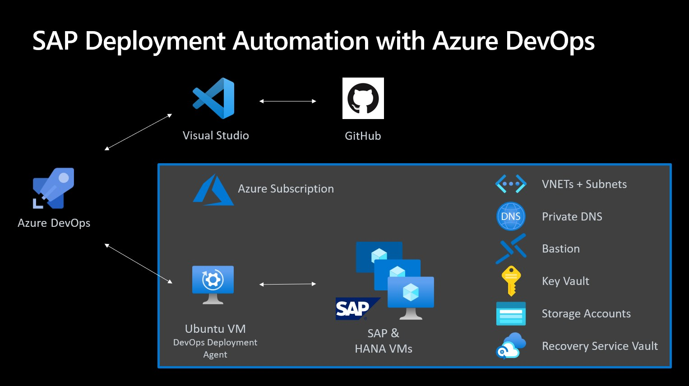

# SAP HANA VM Deployments
This repository can be used to deploy a SAP HANA Database 2.0 with Azure DevOps including the following options: 

* SLES 12 & 15
* RHEL 7 & 8 
* VM sizes from 128GB to 12TB
* OS Preparation with required patches and configurations according to relevant SAP notes
* Backup Integration into an Azure Recovery Service Vault including execution of initial OS & HANA backups
* Selective disk backup (removing hana log & data from OS backups) 
* Setup Azure Enhanced Monitoring for SAP
* Execution of HANA Clound Measurement Tool (HCMT)
* Removal of the complete deployment 

# Deployment Framework

## VM Sizes and Storage Configurations

For just Infrastructure deployments (VM+Storage) without any additional steps you can use this button:
	
 

<table>
	<tr>
		<th>Size</th>
		<th>HANA VM</th>
		<th>HANA VM Storage (EXE + DATA + LOG + SHARE + BACKUP)</th>
	</tr>
	<tr>
		<th>128_GB</th>
		<td>E16ds_v4</td>
		<td>1xP6(64GB) + 3xP6(64GB) + 3xP10(128GB) + 1xP20(512GB) + 1xP20(512GB)</td>
	</tr>
	<tr>
		<th>160_GB</th>
		<td>E20ds_v4</td>
		<td>1xP6(64GB) + 4xP6(64GB) + 3xP10(128GB) + 1xP20(512GB) + 1xP20(512GB)</td>
	</tr>
	<tr>
		<th>192_GB</th>
		<td>M32ts</td>
		<td>1xP6(64GB) + 4xP6(64GB) + 3xP10(128GB) + 1xP20(512GB) + 1xP20(512GB)</td>
	</tr>
	<tr>
		<th>256_GB</th>
		<td>M32ls</td>
		<td>1xP6(64GB) + 4xP6(64GB) + 3xP10(128GB) + 1xP20(512GB) + 1xP20(512GB)</td>
	</tr>
	<tr>
		<th>384_GB</th>
		<td>E48ds_v4</td>
		<td>1xP6(64GB) + 3xP15(256GB) + 3xP10(128GB) + 1xP20(512GB) + 1xP20(512GB)</td>
	</tr>
	<tr>
		<th>512_GB</th>
		<td>M64ls</td>
		<td>1xP6(64GB) + 4xP10(128GB) + 3xP10(128GB) + 1xP20(512GB) + 1xP20(512GB)</td>
	</tr>
	<tr>
		<th>875_GB</th>
		<td>M64ls</td>
		<td>1xP6(64GB) + 4xP15(256GB) + 3xP10(128GB) + 1xP20(512GB) + 1xP20(512GB)</td>
	</tr>
	<tr>
		<th>1.000_GB</th>
		<td>M64ds_v2</td>
		<td>1xP6(64GB) + 4xP15(256GB) + 3xP15(256GB) + 1xP30(1TB) + 1xP30(1TB)</td>
	</tr>
	<tr>
		<th>1.792_GB</th>
		<td>M64dms_v2</td>
		<td>1xP6(64GB) + 4xP20(512GB) + 3xP15(256GB) + 1xP30(1TB) + 1xP30(1TB)</td>
	</tr>
	<tr>
		<th>2.000_GB</th>
		<td>M128ds_v2</td>
		<td>1xP10(128GB) + 4xP20(512GB) + 3xP15(256GB) + 1xP30(1TB) + 1xP30(1TB)</td>
	</tr>
	<tr>
		<th>2.850_GB</th>
		<td>M208s_v2</td>
		<td>1xP10(128GB) + 4xP30(1024GB) + 3xP15(256GB) + 1xP30(1TB) + 1xP30(1TB)</td>
	</tr>
	<tr>
		<th>3.892_GB</th>
		<td>M128dms_v2</td>
		<td>1xP10(128GB) + 5xP30(1024GB) + 3xP15(256GB) + 1xP30(1TB) + 1xP30(1TB)</td>
	</tr>
	<tr>
		<th>5.700_GB</th>
		<td>M208ms_v2</td>
		<td>1xP10(128GB) + 4xP40(2048GB) + 3xP15(256GB) + 1xP30(1TB) + 1xP30(1TB)</td>
	</tr>
	<tr>
		<th>11.400_GB</th>
		<td>M416ms_v2</td>
		<td>1xP10(128GB) + 4xP50(4096GB) + 3xP15(256GB) + 1xP30(1TB) + 1xP30(1TB)</td>
	</tr>
</table>

Note: Eds_v4 Series use premium disk without write accellerations, therefore this is recommended for Non-PRD envrionments only

## Prerequesites
1. [Azure Subscription](https://portal.azure.com/) 
2. [Azure DevOps](http://dev.azure.com/) and [Github](http://github.com/) account 
3. S-User for SAP [Software Downloads](https://launchpad.support.sap.com/)
4. Basic Resources
	* VNET + Subnet
	* Recovery Service Vault with Policies for HANA & OS Backups, "HANA-Non-PRD", "HANA-PRD", "OS-Non-PRD", "OS-PRD"
	* Storage Account (For SAP binaries, Scripts & Boot Diagnostics)
	* Private DNS Zone (Makes everything easier)
	* For green field deployments and especially production workloads please consider using the [Microsoft Cloud Adoption Framework for SAP on Azure](https://docs.microsoft.com/en-us/azure/cloud-adoption-framework/scenarios/sap/enterprise-scale-landing-zone)
5. Setup your own DevOps Deployment Agent within the same or peered VNET 
	* Option A) Manually
    	* Deploy an Ubuntu 18.04 VM. Use a public ssh-key
		* Store you private ssh-key in ~.ssh/id_rsa. Ensure correct file permission. This step is required for Ansible remote ssh to deployed HANA VMs
		* Install [PowerShell](https://docs.microsoft.com/en-us/powershell/scripting/install/installing-powershell-core-on-linux?view=powershell-7.1#ubuntu-1804)
		* Install [Ansible 2.10.*](https://docs.ansible.com/ansible/latest/installation_guide/intro_installation.html#installing-ansible-on-ubuntu)
		* Setup an [Azure DevOps Deployment Agent](https://docs.microsoft.com/en-us/azure/devops/pipelines/agents/v2-linux?view=azure-devops) in your landing zone
			* Use this [tested agent version 2.184.2](https://vstsagentpackage.azureedge.net/agent/2.184.2/vsts-agent-linux-x64-2.184.2.tar.gz) as the latest version doesn't handel SLES 15 SP2 correctly
		* Add your private ssh key to the os user on the agent (.ssh/id_rsa)
		* Install Azure CLI: `curl -sL https://aka.ms/InstallAzureCLIDeb | sudo bash` and perform `az login --use-device-code`. Preferable for a permanent login [create a service principle](https://docs.microsoft.com/en-us/cli/azure/authenticate-azure-cli#sign-in-with-a-service-principal)
		
	* Option B) With this ARM-Template
	
		 

		You'll need to add the target Subnet ID which can be retrieve via `az network vnet subnet list -g ResourceGroup --vnet-name Name --query [].id`

		* Complete the DevOps Deployment Agent Setup with
			1. login with your ssh user and `cd devopsagent ; ./config.sh` -> follow the prompts and enter required information, have the PAT (personal access token) from DevOps ready [see here where to retrieve the PAT](https://docs.microsoft.com/en-us/azure/devops/pipelines/agents/v2-linux?view=azure-devops#authenticate-with-a-personal-access-token-pat) and [in this picture see the script prompts and required entries](./Documentation/Images/agent-setup.jpg)
			2. `sudo ./svc.sh install ; sudo ./svc.sh start`
			3. `az login`. Preferable for a permanent login [create a service principle](https://docs.microsoft.com/en-us/cli/azure/authenticate-azure-cli#sign-in-with-a-service-principal)
			4. put your private ssh-key in ~.ssh/id_rsa (ensure 600 file permission). With this the login from deployment agent to HANA VM will be possible for the Ansible activities.

## Deployment via Azure DevOps
1. Fork this repository in Github or create your own new Repository based on this template
2. Create a Project in Azure DevOps
3. In the DevOps Pipeline Area
	* Create a "New Pipeline" 
	* Where is your code? => "GitHub" 
	* Select a repository => "<git-user>/sap-hana-vm" 
	* Configure your pipeline => "Existing Azure Pipeline YAML file"
	* Branch "Main" 
	* Path "/DevOpsPipeline/azure-pipelines.yml" 
	* Continue and Click on the right side of the Run button to "Save" 
	* Optionally change the name in the Pipeline overview
	* In the process you will need to connect your Github Repository with Azure DevOps [details here](https://docs.microsoft.com/en-us/azure/devops/boards/github/connect-to-github?view=azure-devops)
4. Enter your required variables to the pipeline configuration, [example here](./Documentation/Images/variables.jpg)
5. Add the [Ansible Extension](https://marketplace.visualstudio.com/items?itemName=ms-vscs-rm.vss-services-ansible) to your DevOps Project
6. Download the SAP Binaries IMDB_SERVER*, HCMT* & SAPCAR* and store them in a storage container. Get the new URLs from for the files and update the variables `url_sapcar`, `url_hdbserver`, `url_hcmt` in `Ansible/vars/defaults.yml` 
7. Upload [diskConfig.sh](./Scripts/diskConfig.sh) in the container and adapt variables `url-disk-cfg` in the Pipeline
8. Upload [msawb-plugin-config-com-sap-hana.sh](https://aka.ms/ScriptForPermsOnHANA?clcid=0x0409) to the container and adapt variable `url_msawb_plugin` in `Ansible/vars/defaults.yml` 
9. Adapt Target Subnet parameter, section: `- name: vnet_subnet` in the pipeline to match your landing zone target
10. Setup the [Azure Service Connection](https://docs.microsoft.com/en-us/azure/devops/pipelines/library/connect-to-azure) in [project settings](./Documentation/Images/azure-service-connection.jpg)
11. Run the pipeline

### Todo in future releases
* ASCS & DI Installation
* Cluster Setup 

### Troubleshooting
* ARM deployment fails because the URL to the diskConfig.sh Script is not reachable from the deployed VM. In this case login to the VM and try with wget to download the script. Use your own container in your storage account and ensure it's reachable from VMs in the target subnet
* During Stage "Prepare_OS" ssh connection must work from the deployment agent to the HANA VM. In case of troubles try to connect from the agent maually via ssh and solve the issue. Connection must work without interactive ssh prompts. You might need to set `StrictHostKeyChecking no` in `~/.ssh/config` when deploying VMs with different names to the same IP 
* HANA Installation fails when using forbidden SID: ADD, ALL, AMD, AND, ANY, ARE, ASC, AUX, AVG, BIT, CDC, COM, CON, DBA, END, EPS, FOR, GET, GID, IBM, INT, KEY, LOG, LPT, MAP, MAX, MIN, MON, NIX, NOT, NUL, OFF, OLD, OMS, OUT, PAD, PRN, RAW, REF, ROW, SAP, SET, SGA, SHG, SID, SQL, SUM, SYS, TMP, TOP, UID, USE, USR, VAR
* ...

### FAQ
* Where is the HCMT result?
	- \[hanavm\]:/hana/shared/install/setup/hcmtresult-\<timestamp\>.zip
* How do I create the service principle?
	- Via CLI: https://docs.microsoft.com/en-us/cli/azure/create-an-azure-service-principal-azure-cli 
	- Via Portal: https://docs.microsoft.com/en-us/azure/active-directory/develop/howto-create-service-principal-portal 