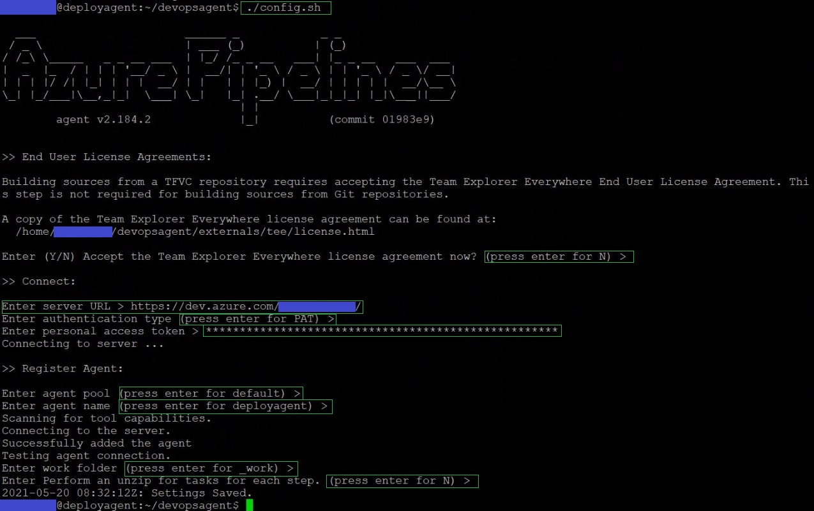
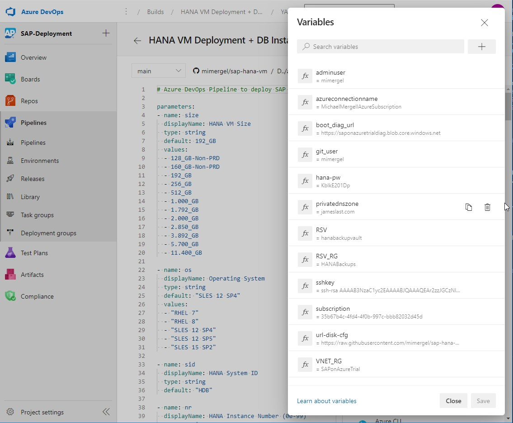

Table of contents
=================

<!--ts-->
- [SAP HANA VM Deployments](#SAP-HANA-VM-Deployments)
- [Deployment Framework](#deployment-framework)
- [HANA VM Sizes and Storage Configurations](#hana-vm-sizes-and-storage-configurations)
    + [Azure Subscription](#azure-subscription)
    + [Azure DevOps and Github account](#azure-devops-and-github-account)
    + [SAP User for the Software Downloads](#sap-user-for-the-software-downloads)
    + [Basic Resources](#basic-resources)
      - [Deploy the Basic Resources](#deploy-the-basic-resources)
    + [Setup the Deployment Agent in an existing landing zone](#setup-the-deployment-agent-in-an-existing-landing-zone)
      - [Option A With this ARM-Template](#option-a-with-this-arm-template)
      - [Option B Manually](#option-b-manually)
      - [Finalize the Deployment Agent Setup](#finalize-the-deployment-agent-setup)
- [Setup the Azure DevOps Pipeline](#setup-the-azure-devops-pipeline)
- [HANA VM Deployment - Run the Azure DevOps Pipeline](#hana-vm-deployment---run-the-azure-devops-pipeline)
- [HANA Cloud Measurement Test Results](#hana-cloud-measurement-test-results)
- [SAP VM Deployment](#sap-vm-deployment)
- [Todo](#todo)
- [Troubleshooting](#troubleshooting)
- [FAQ](#faq)
- [Disclaimer](#disclaimer)
<!--te-->

# SAP HANA VM Deployments

This repository is used to deploy SAP HANA Databases 2.0 with Azure DevOps including the following options: 

* SLES 12 & 15
* RHEL 7 & 8 
* VM sizes from 128GB to 12TB
* OS Preparation with required patches and configurations according to relevant SAP notes
* HANA 2.0 Installation
* Backup Integration into an Azure Recovery Service Vault including execution of initial OS & HANA backups
* Selective disk backup, which excludes hana log & data disks from the OS backups
* Setup Azure Monitoring Extension for SAP
* Execution of HANA Cloud Measurement Tool (HCMT)
* Removal of the complete deployment 

# Deployment Framework

The DevOps Pipeline is used as a GUI to simplify deployments. It fetches the pipeline from the GitHub repository. The GitHub repository itself can be most easily adapted to your landing zone specifics with Visual Studio Code on your local PC. In the grey rectangle we see the Ubuntu VM which acts as deployment agent and the require Azure ressources like VNET, Recovery Service Vault, Storage, etc. 

# HANA VM Sizes and Storage Configurations

<table>
	<tr>
		<th>Size</th>
		<th>HANA VM</th>
		<th>HANA VM Storage (EXE + DATA + LOG + SHARE + BACKUP)</th>
	</tr>
	<tr>
		<th>128_GB</th>
		<td>E16ds_v4</td>
		<td>1xP6(64GB) + 3xP6(64GB) + 3xP10(128GB) + 1xP20(512GB) + 1xP20(512GB)</td>
	</tr>
	<tr>
		<th>160_GB</th>
		<td>E20ds_v4</td>
		<td>1xP6(64GB) + 4xP6(64GB) + 3xP10(128GB) + 1xP20(512GB) + 1xP20(512GB)</td>
	</tr>
	<tr>
		<th>192_GB</th>
		<td>M32ts</td>
		<td>1xP6(64GB) + 4xP6(64GB) + 3xP10(128GB) + 1xP20(512GB) + 1xP20(512GB)</td>
	</tr>
	<tr>
		<th>256_GB</th>
		<td>M32ls</td>
		<td>1xP6(64GB) + 4xP6(64GB) + 3xP10(128GB) + 1xP20(512GB) + 1xP20(512GB)</td>
	</tr>
	<tr>
		<th>384_GB</th>
		<td>E48ds_v4</td>
		<td>1xP6(64GB) + 3xP15(256GB) + 3xP10(128GB) + 1xP20(512GB) + 1xP20(512GB)</td>
	</tr>
	<tr>
		<th>512_GB</th>
		<td>M64ls</td>
		<td>1xP6(64GB) + 4xP10(128GB) + 3xP10(128GB) + 1xP20(512GB) + 1xP20(512GB)</td>
	</tr>
	<tr>
		<th>875_GB</th>
		<td>M64ls</td>
		<td>1xP6(64GB) + 4xP15(256GB) + 3xP10(128GB) + 1xP20(512GB) + 1xP20(512GB)</td>
	</tr>
	<tr>
		<th>1.000_GB</th>
		<td>M64ds_v2</td>
		<td>1xP6(64GB) + 4xP15(256GB) + 3xP15(256GB) + 1xP30(1TB) + 1xP30(1TB)</td>
	</tr>
	<tr>
		<th>1.792_GB</th>
		<td>M64dms_v2</td>
		<td>1xP6(64GB) + 4xP20(512GB) + 3xP15(256GB) + 1xP30(1TB) + 1xP30(1TB)</td>
	</tr>
	<tr>
		<th>2.000_GB</th>
		<td>M128ds_v2</td>
		<td>1xP10(128GB) + 4xP20(512GB) + 3xP15(256GB) + 1xP30(1TB) + 1xP30(1TB)</td>
	</tr>
	<tr>
		<th>2.850_GB</th>
		<td>M208s_v2</td>
		<td>1xP10(128GB) + 4xP30(1024GB) + 3xP15(256GB) + 1xP30(1TB) + 1xP30(1TB)</td>
	</tr>
	<tr>
		<th>3.892_GB</th>
		<td>M128dms_v2</td>
		<td>1xP10(128GB) + 5xP30(1024GB) + 3xP15(256GB) + 1xP30(1TB) + 1xP30(1TB)</td>
	</tr>
	<tr>
		<th>5.700_GB</th>
		<td>M208ms_v2</td>
		<td>1xP10(128GB) + 4xP40(2048GB) + 3xP15(256GB) + 1xP30(1TB) + 1xP30(1TB)</td>
	</tr>
	<tr>
		<th>11.400_GB</th>
		<td>M416ms_v2</td>
		<td>1xP10(128GB) + 4xP50(4096GB) + 3xP15(256GB) + 1xP30(1TB) + 1xP30(1TB)</td>
	</tr>
</table>

Note: Eds_v4 Series use premium disk without write accellerations, therefore this is recommended for Non-PRD envrionments only

## Deploy **only** a HANA VM and Storage via ARM

 

Note: Required target Subnet ID can be retrieved in cloud shell via:  
`az network vnet subnet list -g [ResourceGroup] --vnet-name [Name] --query [].id`

# Prerequesites for DevOps Deployments

1. ### [Azure Subscription](https://portal.azure.com/) 
2. ### [Azure DevOps](http://dev.azure.com/) and [Github](http://github.com/) account
3. ### SAP User for the [Software Downloads](https://launchpad.support.sap.com/)
4. ### Basic Resources
	* VNET + Subnets + NSGs
	* Recovery Service Vault with Policies for HANA & OS Backups 
	* Storage Accounts (For SAP binaries, Scripts & Boot Diagnostics)
	* Bastion Host
	* DevOps Deployment Agent 
	* Windows 10 Admin Host (For HANA Studio, SAPGui, Easy SAPBits Upload to storage account, etc.)

	#### Deploy the Basic Resources
	Use this button to setup all of the above for a basic landing zone. When done continue with 5.iii

	 

	**For production workloads use the [Microsoft Cloud Adoption Framework to build the SAP landing zone](https://docs.microsoft.com/en-us/azure/cloud-adoption-framework/scenarios/sap/enterprise-scale-landing-zone)**

5. ### Setup the Deployment Agent in an existing landing zone
	1. #### Option A With this ARM-Template	
		 

		Note: Required target Subnet ID can be retrieved in cloudshell via `az network vnet subnet list -g [ResourceGroup] --vnet-name [Name] --query [].id`

	2. #### Option B Manually 
    	* Deploy an Ubuntu 18.04 VM. Use a public ssh-key.
		* Install [PowerShell](https://docs.microsoft.com/en-us/powershell/scripting/install/installing-powershell-core-on-linux?view=powershell-7.1#ubuntu-1804)
		* Install [Ansible 2.10.*](https://docs.ansible.com/ansible/latest/installation_guide/intro_installation.html#installing-ansible-on-ubuntu)
		* Setup an [Azure DevOps Deployment Agent](https://docs.microsoft.com/en-us/azure/devops/pipelines/agents/v2-linux?view=azure-devops) in your landing zone
		Use this [tested agent version 2.184.2](https://vstsagentpackage.azureedge.net/agent/2.184.2/vsts-agent-linux-x64-2.184.2.tar.gz) as the latest version doesn't handel SLES 15 SP2 correctly
		* Install Azure CLI:  
			`curl -sL https://aka.ms/InstallAzureCLIDeb | sudo bash`

	3. #### Finalize the Deployment Agent Setup
		* Login with your ssh user to the ubuntu based deployment agent, then  
			`cd devopsagent ; ./config.sh`  
			Follow the prompts and enter required information, have the PAT (personal access token) from DevOps ready [see here where to retrieve the PAT](https://docs.microsoft.com/en-us/azure/devops/pipelines/agents/v2-linux?view=azure-devops#authenticate-with-a-personal-access-token-pat)
		
		* Ensure the deployment agent software is automatically started as a service after each reboot:  
			`sudo ./svc.sh install ; sudo ./svc.sh start`
		* Login to Azure  
			`az login`   
			Optionally for a permanent login [create a service principle](https://docs.microsoft.com/en-us/cli/azure/authenticate-azure-cli#sign-in-with-a-service-principal)
		* Save your private ssh-key in `~/.ssh/id_rsa` (ensure 600 file permission). This ensures possible login from the deployment agent to the HANA VM which is required for Ansible activities.

# Setup the Azure DevOps Pipeline

1. Fork this repository in Github or create your own new Repository based on this template
2. Create a Project in Azure DevOps
3. In the DevOps Pipeline Area
	* Create a "New Pipeline" 
	* Where is your code? => "GitHub" 
	* Select a repository => "\<git-user\>/sap-hana-vm" 
	* Configure your pipeline => "Existing Azure Pipeline YAML file"
	* Branch "Main" 
	* Path "/DevOpsPipeline/hana-vm.yml" 
	* Continue and Click on the right side of the Run button to "Save" 
	* Optionally change the name in the Pipeline overview
	* In the process you will need to connect your Github Repository with Azure DevOps [details here](https://docs.microsoft.com/en-us/azure/devops/boards/github/connect-to-github?view=azure-devops)
4. Add the [Ansible Extension](https://marketplace.visualstudio.com/items?itemName=ms-vscs-rm.vss-services-ansible) to your DevOps Project
5. Download the required SAP Binaries [SAPCAR*](https://softwaredownloads.sap.com/file/0020000002208852020), [IMDB_SERVER*](https://stsapbitsfrancecent.blob.core.windows.net/sapbits/IMDB_SERVER20_055_0-80002031.SAR ), optionally [HCMT*](https://softwaredownloads.sap.com/file/0020000000392012021) and [XSA components](https://softwaredownloads.sap.com/file/0030000000269122021). Store the files in a storage container. Get the URLs from the storage container and update the variables `url_sapcar`, `url_hdbserver`, `url_hcmt` in `Ansible/vars/defaults.yml`. An easy way to download the SAP binaries is on the sapwinadmin host where you can connect with the Azure Bastion Service. From there you can upload to the Storage Account via the Azure Portal.
6. In case the target networks don't have access to the internet
	* Upload [diskConfig.sh](./Scripts/diskConfig.sh) in the storage container and adapt variables `url-disk-cfg` in the Pipeline
	* Upload [msawb-plugin-config-com-sap-hana.sh](https://aka.ms/ScriptForPermsOnHANA?clcid=0x0409) to the container and adapt variable `url_msawb_plugin` in `Ansible/vars/defaults.yml` 
7. Adapt Target Subnet parameter, section: `- name: vnet_subnet` in the pipeline to match your landing zone target
8. [Create an azure resource manager service connection with an existing service principal](https://docs.microsoft.com/en-us/azure/devops/pipelines/library/connect-to-azure?view=azure-devops#create-an-azure-resource-manager-service-connection-with-an-existing-service-principal) in [project settings](./Documentation/Images/azure-service-connection.jpg)
9. Enter the required variables to the pipeline configuration. Use the values corresponding to your target landing zone:  
	

# HANA VM Deployment - Run the Azure DevOps Pipeline 

Now you're ready to deploy the SAP HANA VM including subsequent tasks.
* Run the pipeline 
* Provide inputs as required 

# HANA Cloud Measurement Test Results
* The tests run a couple of hours. Once the execution is completed it will create a file here: \[hanavm\]:/hana/shared/install/setup/hcmtresult-\<timestamp\>.zip
* You need to upload the results file on a SAP web site to check if the systems meet the configuration and performance requirements. Upload link: [https://hotui-supportportal.dispatcher.hana.ondemand.com/index.html](https://hotui-supportportal.dispatcher.hana.ondemand.com/index.html) 
* More information on HCMT [in this blog](https://blogs.sap.com/2019/12/04/sap-hana-hardware-and-cloud-measurement-tools-hcmt-replacement-of-hwcct-tool/)  
	

# SAP VM Deployment
Use this ARM template to deploy the SAP Application VMs.
Automated SAP Installation and deployment via an Azure DevOps Pipeline functionality will be added soon.

 

# Todo
* SAP Installation
* HA Cluster Setup 
* HANA Scale-Out Deployments

# Troubleshooting
* ARM deployment fails because the URL to the diskConfig.sh Script is not reachable from the deployed VM. In this case login to the VM and try with wget to download the script. Use your own container in your storage account and ensure it's reachable from VMs in the target subnet
* During Stage "Prepare_OS" ssh connection must work from the deployment agent to the HANA VM. In case of troubles try to connect from the agent maually via ssh and solve the issue. Connection must work without interactive ssh prompts. You might need to set `StrictHostKeyChecking no` in `~/.ssh/config` when deploying VMs with different names to the same IP 
* HANA Installation fails when using forbidden SID: ADD, ALL, AMD, AND, ANY, ARE, ASC, AUX, AVG, BIT, CDC, COM, CON, DBA, END, EPS, FOR, GET, GID, IBM, INT, KEY, LOG, LPT, MAP, MAX, MIN, MON, NIX, NOT, NUL, OFF, OLD, OMS, OUT, PAD, PRN, RAW, REF, ROW, SAP, SET, SGA, SHG, SID, SQL, SUM, SYS, TMP, TOP, UID, USE, USR, VAR
* The pipeline fails in step "Prepare OS
	* ~/.ssh/id_rsa file is missing or has wrong permissions.
	* Add `host_key_checking = False` to the ansible configuration file `/etc/ansible/ansible.cfg`. This will prevent ssh prompts during first logins.
* Ansible stages do not run
	* Try to run the Ansible command on the deployment agent manually
	* Therefore clone the code on the deployment agent: 
		* `git clone https://github.com/<your-git-user-id>/sap-hana-vm.git`
		* Add the fqdn of the VM into the file `/etc/ansible/hosts`
		* `cd sap-hana-vm`
		* Execute: `ansible-playbook -vvvv Ansible/os-settings_playbook.yml`
		* Analyse the now more detailed debugging information due to option "-vvvv"
* Failed to set permissions on the temporary files Ansible needs to create when becoming an unprivileged user
	* On the deployment agent set `allow_world_readable_tmpfiles = True` in `/etc/ansible/ansible.cfg`	
* Backup or SAP Monitoring scripts fails
	* Perform `az login` on the ubuntu deployment agent
* Deployment of the devopsdeployer VM fails in the last step: message: "VM has reported a failure when processing extension 'CustomScript' ..."
	* The VM might not have access to the internet and therefore cannot download the custom script that handles to download of ansible, azure cli, etc.
	* Solution: Adapt the FW and grant temporarily (e.g. for 5 minutes) internet access for the VM. Run the custom script manually. Steps:
		* `wget https://raw.githubusercontent.com/mimergel/sap-hana-vm/main/Scripts/setup-deployment-agent.sh`
		* `chmod 755 setup-deployment-agent.sh`
		* `sudo ./setup-deployment-agent.sh`
* The Self-hosted DevOps deployment agent is not able to connect to Azure DevOps
	* Make sure the deployment agent VM is able to connect to Azure DevOps, most likely a FW rule is required. [See here for details.](https://docs.microsoft.com/en-us/azure/devops/organizations/security/allow-list-ip-url?view=azure-devops&tabs=IP-V4#ip-addresses-and-range-restrictions)

# FAQ
* Where is the HCMT result?
	- \[hanavm\]:/hana/shared/install/setup/hcmtresult-\<timestamp\>.zip
	- Upload the test results [here](https://hotui-supportportal.dispatcher.hana.ondemand.com/index.html)
	- More information on HCMT [here](https://blogs.sap.com/2019/12/04/sap-hana-hardware-and-cloud-measurement-tools-hcmt-replacement-of-hwcct-tool/)
* How do I create the service principle?
	- Via CLI: https://docs.microsoft.com/en-us/cli/azure/create-an-azure-service-principal-azure-cli 
	- Via Portal: https://docs.microsoft.com/en-us/azure/active-directory/develop/howto-create-service-principal-portal 
* I don't like entering so many variables manually. Isn't there a better way?
	- Create variable groups in the Pipelines Library and assign the groups to the relevant pipelines
	- You could use a set of global variables relevant for all pipelines and a set for specific areas like, workload types, subscriptions, regions, etc.  
		See an example here:  
		

# Disclaimer
THIS REPOSITORY AND ALL IT'S CONTENT IS PROVIDED AS IS WITHOUT WARRANTY OF ANY KIND, EITHER EXPRESS OR IMPLIED, INCLUDING ANY IMPLIED WARRANTIES OF FITNESS FOR A PARTICULAR PURPOSE, MERCHANTABILITY, OR NON-INFRINGEMENT.  

 
